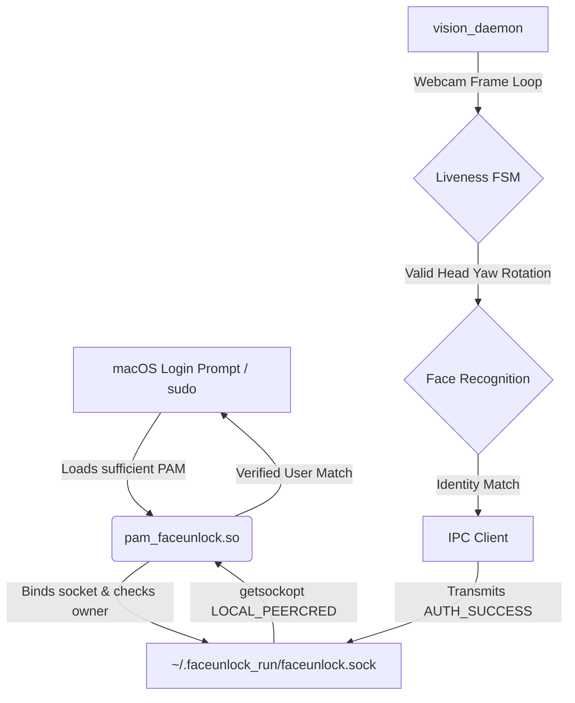

# macOS FaceUnlock (Apple Silicon)

An enterprise-grade, offline face authentication platform designed for macOS. Since Apple hardware lacks dedicated infrared (IR) depth cameras for Face ID on laptops, this project implements a secure software-based biometric unlock solution using the standard FaceTime RGB webcam. 

To prevent presentation attacks (spoofing via printed photos or iPads), the platform utilizes an **Active Liveness 3D State Machine** powered by MediaPipe and custom OpenCV geometry. It communicates with the macOS Pluggable Authentication Module (PAM) kernel boundary using a **hardened UNIX Domain Socket IPC layer** with macOS Peer Credential checks (`LOCAL_PEERCRED`).

---

## System Architecture

The repository is modularized into isolated layers to reduce coupling, enforce privilege boundaries, and prevent local security escalations:



### Core Components

1. **`pam/`**: Pluggable Authentication Module written in C++. Integrates directly into macOS authentication subsystem (`/etc/pam.d/sudo`, `/etc/pam.d/screensaver`). Implements 5-second `select()` socket timeouts to guarantee fallback to Password/Touch ID in case of failure.
2. **`vision_daemon/`**: Lightweight background process analyzing the camera feed.
   - `core/detector.py`: BlazeFace Face Detection TFLite runner.
   - `core/antispoof.py`: Active liveness challenge-response FSM.
   - `core/recognizer.py`: Multi-identity dlib vector matching with disk I/O caching.
   - `core/encoder.py`: Dynamic enrollment CLI tool for registration.
3. **`ipc/`**: Client interface transmitting authorization signals securely to the socket listener.
4. **`configs/`**: JSON configuration validation module for custom distances, camera index, and yaw thresholds.
5. **`scripts/`**: Setup, bootstrap, installation plists, and environment validation scripts.
6. **`tests/`**: Offline automated unit and integration tests.

---

## Hardened Security Posture

Designed to undergo strict security reviews, this platform implements defense-in-depth security mitigations:

| Attack Vector | Vulnerability | Engineering Mitigation |
| :--- | :--- | :--- |
| **Local Spoofing** | A malicious unprivileged process writes to root's authentication socket. | **macOS Peer Credentials Verification**: The C++ PAM module performs `getsockopt(client_fd, 0, LOCAL_PEERCRED, ...)` to guarantee that the connecting client process UID matches the target logging user's UID. Untrusted connections are dropped immediately. |
| **Presentation Attack** | 2D photographs or video playback on high-res displays bypass face checks. | **Active Liveness Challenge-Response**: Uses a 3D transformation matrix to calculate head yaw. The user must rotate their head in a randomized direction (LEFT or RIGHT) and return to center within 5 seconds. |
| **Privilege Escalation** | Rogue client writes arbitrary username payload to socket. | **Dynamic Socket Ownership**: Socket resides in user's home directory (`~/.faceunlock_run`), gets dynamically `chown`ed to the logging-in user, and restricted via discretionary access control to `0600` permissions. |
| **System Lockout** | Vision daemon crashes or camera is busy, hanging authentication. | **Select Timeout Fallbacks**: The C++ PAM module utilizes non-blocking `select()` calls capped at 5 seconds. If no successful biometric signal is received, the module returns `PAM_IGNORE`, cleanly falling back to Apple's password prompt. |

---

## Installation & Deployment

### 1. Developer Bootstrap
Clone the repository and run the developer bootstrap script to provision a local virtual environment, download the required landmarkers, and compile the C++ PAM module:
```bash
./scripts/bootstrap.sh
```

### 2. Environment Verification
Validate that your environment is fully compatible, configurations are correct, and security permissions are secure:
```bash
./scripts/check_env.sh
```

### 3. Enroll Your Identity
Capture and generate your 128-D facial vector profile (run with `--auto` for headless capture, or GUI mode will open a monitor window):
```bash
./venv/bin/python vision_daemon/core/encoder.py --username $USER
```

### 4. Install the PAM Module & Daemon Service
Run the installer script with root permissions to install the compiled library to the macOS PAM directory and register the LaunchAgent daemon service:
```bash
sudo ./scripts/install.sh
```

Follow the post-install instructions to enable the background service:
```bash
launchctl load -w ~/Library/LaunchAgents/com.faceunlock.daemon.plist
```

To complete macOS integration, append the following line to the top of `/etc/pam.d/sudo` or `/etc/pam.d/screensaver`:
```text
auth       sufficient     /usr/local/lib/pam/pam_faceunlock.so
```

---

## Testing & Benchmarks

### Running Automated Test Suite
The repository includes a comprehensive, zero-dependency unit and integration test suite mocking camera and landmark hardware. It validates state machine transitions, socket communication, and profile directories in under 3 seconds:
```bash
./venv/bin/python -m unittest discover -s tests -p "test_*.py"
```

### Running Performance Benchmarks
To measure serialization speed and pose-geometry computation latency:
```bash
./venv/bin/python benchmarks/run_benchmarks.py
```
*Results will be cached in `benchmarks/benchmark_results.json`.*

---

## Uninstallation
To cleanly stop the LaunchAgent daemon and delete all binaries from system paths:
```bash
sudo ./scripts/uninstall.sh
```
*Remember to remove the PAM config line from `/etc/pam.d/sudo`.*
